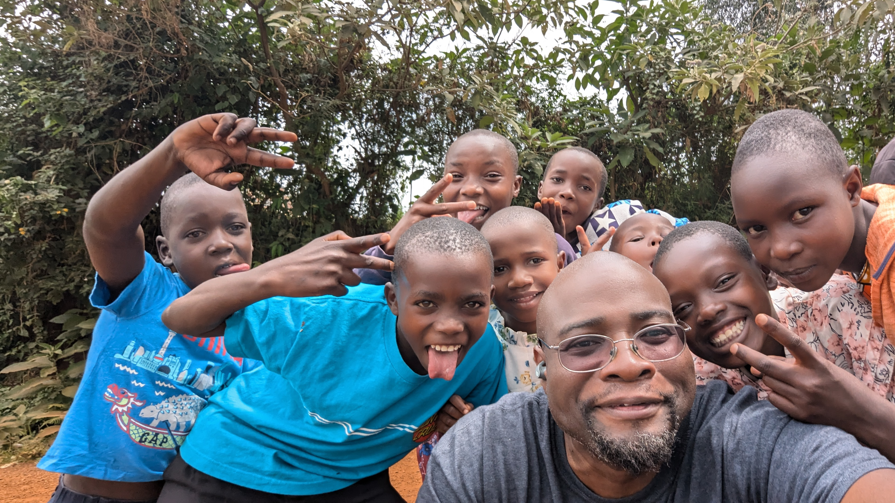
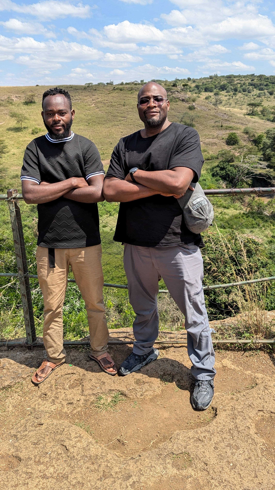
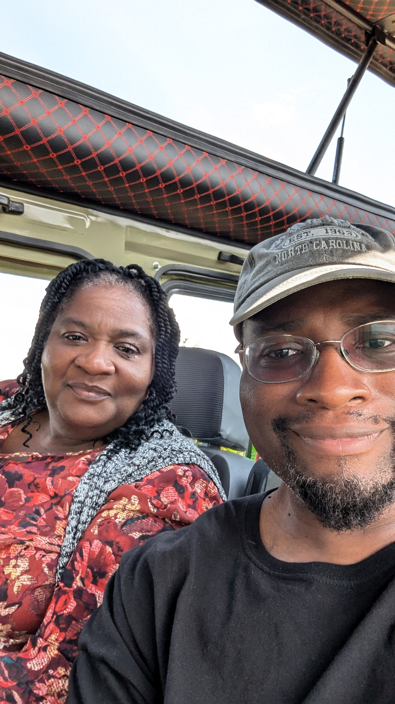
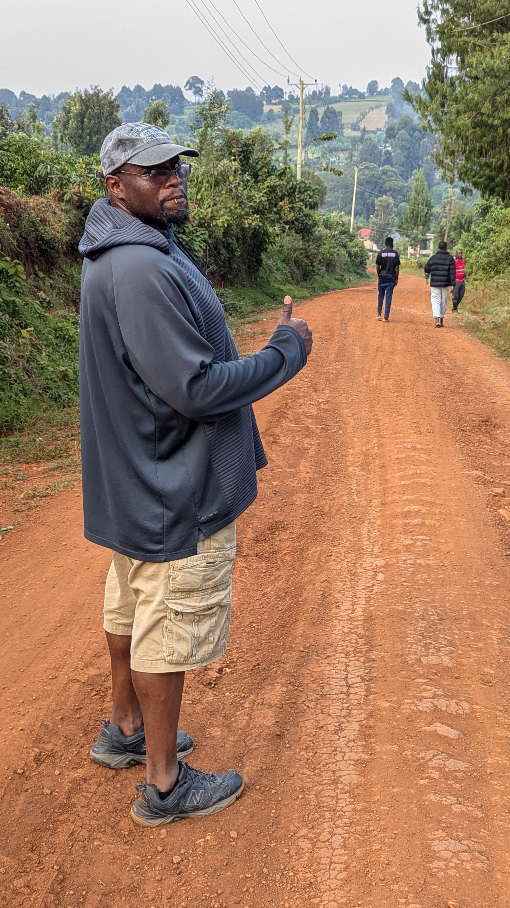
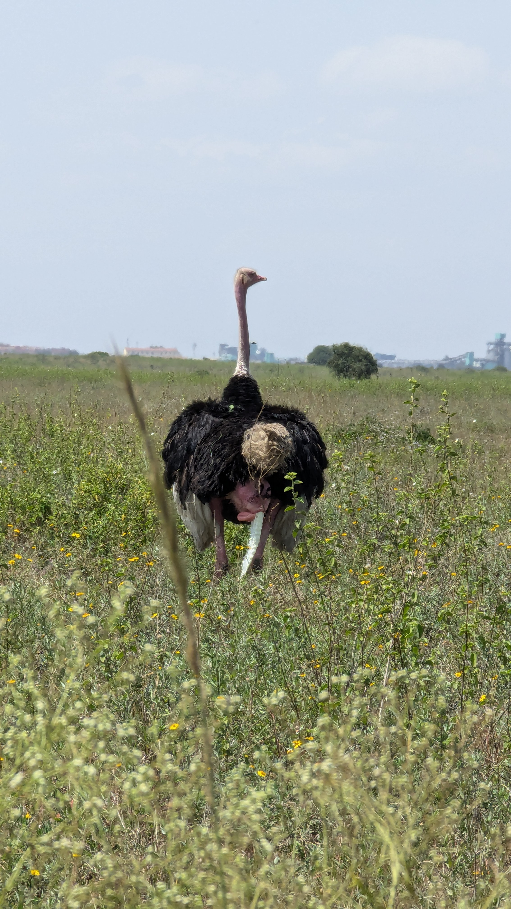

### [Cybersecurity](https://github.com/Komonodrg-portfolio/Cybersecurity) | [Networking](https://github.com/Komonodrg-portfolio/Networking) | [Data Science (AI)](https://github.com/Komonodrg-portfolio/AI) | [Media Creation](https://github.com/Komonodrg-portfolio/MediaCreation)

# 🌍 Mission: Empower Through Tech – Cybersecurity, Networking & AI

## 💡 Overview

Welcome to my Mission Repo – a personal and professional journey combining continuous learning in Cybersecurity, Network Engineering, and Artificial Intelligence, with a mission to empower others, especially those in underdeveloped regions & underserverd communities, through open access to knowledge, tools, and real-world use cases.

This repository is more than a **portfolio** – it's a commitment to use technology as a force for positivity, both domestically and abroad globally.

## 🚀 Mission Goals

My goal is to create structured, beginner-friendly training and project materials in Cybersecurity, Networking, Media Creation all while leveraging AI, specifically designed for learners of all walks. The main focal points:

- **Open-access educational materials**
    
- **Low-bandwidth (cost) friendly resources**
    
- **Translatable content & culturally relevant examples**
    
- **GitHub-based learning & collaboration**
    
- **Remote mentoring opportunities (coming soon)**
  
This mission is driven by the belief that **access to digital skills can change lives**, unlock careers, and foster innovation globally.
 

  
<em><b>🪂  "One Man's Thoughts..."</b></em>

    
  This is the hidden content that will appear when the link is clicked.

  
  
  
    

  You can include **Markdown** _formatting_ inside here too.

  - Bullet point
  - Another point

### 🤝 2. **Impact Local Businesses**

I'm also applying my growing skills to support **local businesses in need of tech help**, with a focus on **practical, cost-effective solutions**.

#### 🌾 Small Farm Project

Helping a local farmer:

- IoT research for soil and water monitoring
    
- Planning a small-scale network for sensors and data collection
    
- Exploring AI-powered crop health analysis (image classification, anomaly detection)
    

#### 🧼 Cleaning Services Support

Helping a friend’s cleaning company:

- Setting up a secure, automated booking/contact system
    
- Creating a professional online presence
    
- Exploring automation tools for scheduling and billing
    
- Securing internal data with cybersecurity best practices
