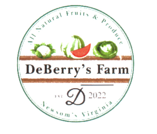

### [Home](https://github.com/Komonodrg-portfolio) | [Cybersecurity](https://github.com/Komonodrg-portfolio/Cybersecurity) | [Networking](https://github.com/Komonodrg-portfolio/Networking) | [Data Science (AI)](https://github.com/Komonodrg-portfolio/AI) | [Media Creation](https://github.com/Komonodrg-portfolio/MediaCreation)

# 🌍 Mission

## 🌐 Overview

Welcome to my Mission Repo – a personal and professional journey combining continuous learning in Cybersecurity, Network Engineering, and Artificial Intelligence, with a mission to empower others, especially those in underdeveloped regions & underserverd communities, through open access to knowledge, tools, and real-world use cases.

This repository is more than a **portfolio** – it's a commitment to use technology as a force for positivity, both domestically and abroad globally.

## 🚀 Mission Goals
### 🤝 1. **Provide Training Materials Globally**

My goal is to create structured, beginner-friendly training and project materials in Cybersecurity, Networking, Media Creation all while leveraging AI, specifically designed for learners of all walks. The main focal points:

- **Open-access educational materials**
    
- **Low-bandwidth (cost) friendly resources**
    
- **Translatable content & culturally relevant examples**
    
- **GitHub-based learning & collaboration**
    
- **Remote mentoring opportunities (coming soon)**
  
This mission is driven by the belief that **access to digital skills can change lives**, unlock careers, and foster innovation globally.
 

 
<h3><em><b>🪂  "One Man's Thoughts..."</b></em></h3>

    
<em>The summer of 2024 was an exciting time for me!  Being the son of immigrants, it was cool getting a chance to take a trip to visit the continent of my parents origin - icing on the cake was being able to travel to Kenya with my Mom (bucket list item - ✔️!)  We spent a little under a month traveling the country (literally from mountain to coast) taking in the wonders Kenya had to offer.  From the beaches of Mombasa/Nyali, to a safari in Nairobi, fishing Lake Victoria, & spending sometime in the mountains of Kisii to visit with friends, it was the trip of a lifetime.   
  
Coming back to the US was bittersweet.  Though I missed my wife and kids tremendously while gone, I couldn't shake this feeling to give back to a people who gave so much to us while on our journeys.  Specifically, I thought of the kids in a village where we attended church one Saturday(pic below) and spent a while considering how I best could leverage my talents to help them be all they could aspire to be in this lifetime, despite the extreme hardships felt in remote/rural communities.  My answer and love letter to them and all the lifelong friends met along the way: creating this repo.</em> 
 
<b>My Vision:</b> 
    
- <b>To partner or create a foundation that will provide repurposed/decommissioned cellphones / laptops to individuals in remote area</b>
- <b>Provide scholarships to cover the costs for IT Certifications to individuals showing deep aptitude, skill, and readiness</b> 

<em>Enjoy these pictures from the trip.

Colleagues,
  
  
Onward. </em>

  

  
  
  
  
  
    
  
  

  

### 🤝 2. **Impact Local Businesses**

I'm also applying my growing skills to support **real-world local businesses in need of tech help**, with a focus on **practical, cost-effective solutions**.

#### 🌾 Small Farm Project

Helping a local farmer:

- IoT research for soil and water monitoring
    
- Planning a small-scale network for sensors and data collection
    
- Exploring AI-powered crop health analysis (image classification, anomaly detection)
    

#### 🧼 Cleaning Services Support

Helping a colleagues cleaning company:

- Setting up a secure, automated booking/contact system
    
- Creating a professional online presence
    
- Exploring automation tools for scheduling and billing
    
- Securing internal data with cybersecurity best practices

 
<h3><em><b>🪂  "One Man's Thoughts..."</b></em></h3>

    
<em>The summer of 2024 was an exciting time for me!  Being the son of immigrants, it was cool getting a chance to take a trip to visit the continent of my parents origin - icing on the cake was being able to travel to Kenya with my Mom (bucket list item - ✔️!)  We spent a little under a month traveling the country (literally from mountain to coast) taking in the wonders Kenya had to offer.  From the beaches of Mombasa/Nyali, to a safari in Nairobi, fishing Lake Victoria, & spending sometime in the mountains of Kisii to visit with friends, it was the trip of a lifetime.   
  
Coming back to the US was bittersweet.  Though I missed my wife and kids tremendously while gone, I couldn't shake this feeling to give back to a people who gave so much to us while on our journeys.  Specifically, I thought of the kids in a village where we attended church one Saturday(pic below) and spent a while considering how I best could leverage my talents to help them be all they could aspire to be in this lifetime, despite the extreme hardships felt in remote/rural communities.  My answer and love letter to them and all the lifelong friends met along the way: creating this repo.</em> 
 
<b>My Vision:</b> 
    
- <b>To partner or create a foundation that will provide repurposed/decommissioned cellphones / laptops to individuals in remote area</b>
- <b>Provide scholarships to cover the costs for IT Certifications to individuals showing deep aptitude, skill, and readiness</b> 

<em>Enjoy these pictures from the trip.

Colleagues,
  
  
Onward. </em>
